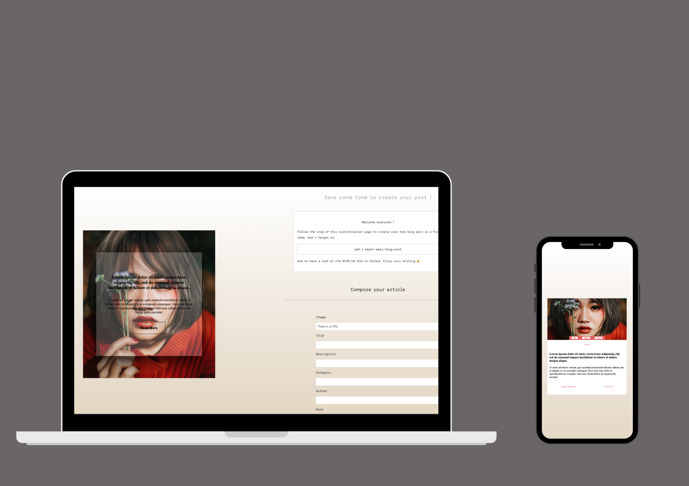

# React-easy-blog-post

`React-easy-blog-post` is an open source project, published on NPM that allows you to create in a fraction of time your future blog post ! ✍️

## Getting-Started

```bash
npm install react-easy-blog-post-component
```

## Screenshot

<div align="center">
  
</div>

### How to use

Nothing as easy ! Go have a look at the [DEMO](https://chthve.github.io/react-easy-blog-post/)

**Step 1:** Import the component

Make your choice first (Banner, Card or List) and import it right here 👇

```js
import {<Your Choice>} from 'react-easy-blog-post';
```

**Step 2:** Simply use it in your app ! Example:

```typescript jsx
  <Banner article={article} theme={height: "668px",
    width: "652px",
    fontFamily: "Gill Sans",
    smallFont: "9px",
    mediumFont: "15px",
    largeFont: "22px",
    primary: "#a62626",
    secondary: "#b20a0a",
    style: "2",} hover=true />
```

## Configuration

### Data Format

**Your article is an object and should be like that:**

```typescript jsx
const article={
  author: "Charles Bukowsk",
  category: "Poetry",
  title: "Lorem ipsum dolor sit amet, consectetur adipiscing elit, sed do eiusmod tempor incididunt ut labore et dolore magna aliqua. description: Ut enim ad minim veniam, quis nostrud exercitation ullamco laboris nisi ut aliquip ex ea commodo consequat. Duis aute irure dolor in reprehenderit in voluptate velit esse cillum dolore eu fugiat nulla pariatur.",
  date: 1605188922555
  image: "https://images.unsplash.com/photo-1605453302863-85c32f2adc76?ixlib=rb-1.2.1&ixid=eyJhcHBfaWQiOjEyMDd9&auto=format&fit=crop&w=800&q=60"
  }
```

### Author

- Charles-Thibault Verrier - [GitHub](https://github.com/chthve) - [Linkedin](https://linkedin.com/in/chthve)

## License

MIT © [chthve](https://github.com/chthve)
